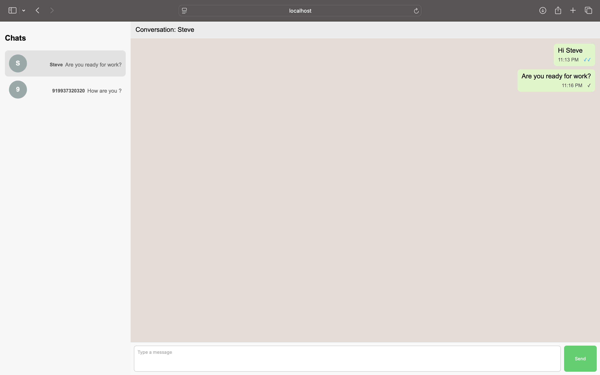
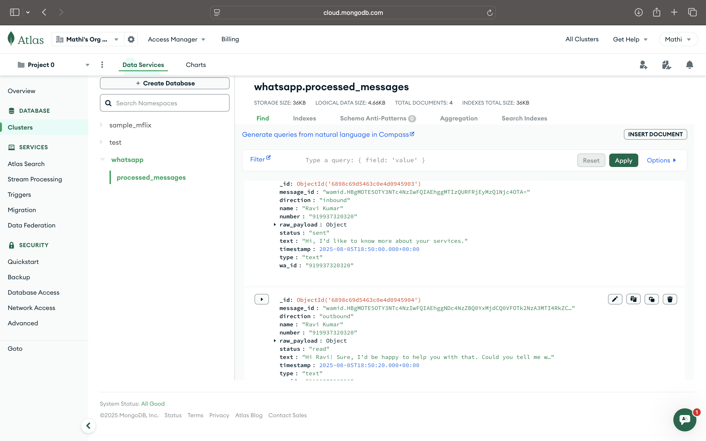
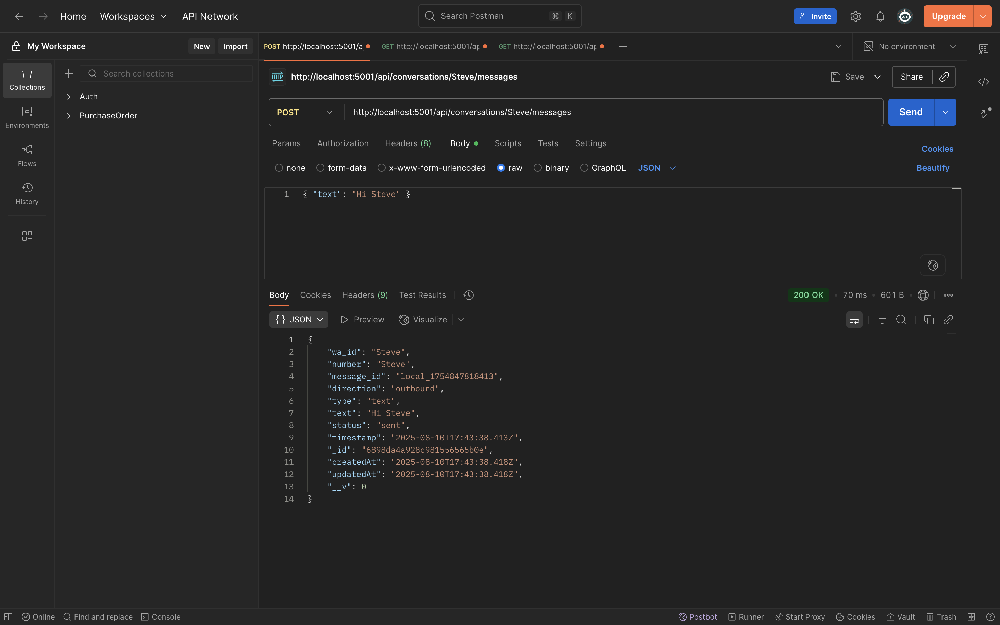
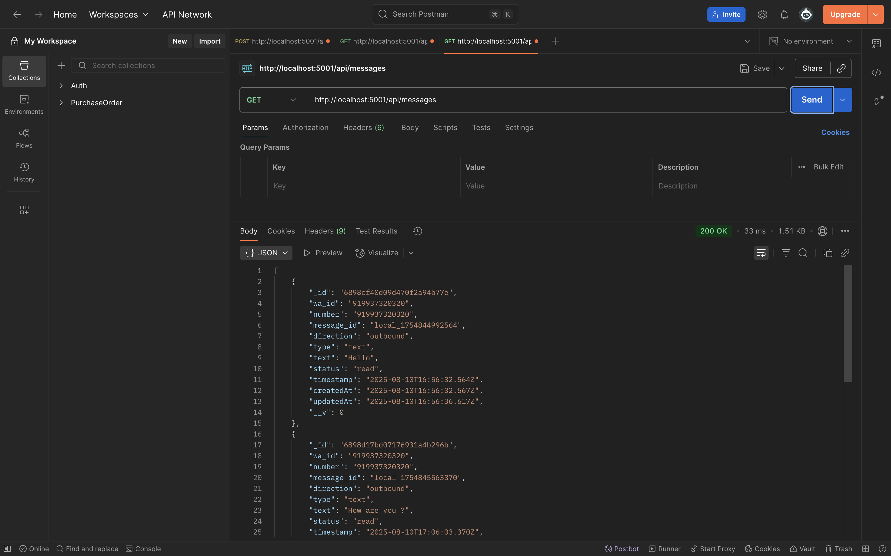

# WhatsApp Chat Dashboard

A full-stack application for viewing and managing WhatsApp chat conversations.  
Built with React (frontend) and Node.js/Express + MongoDB (backend).

## Features

- Conversation list showing all WhatsApp conversations from MongoDB
- Chat window to view messages in a selected conversation
- Send new messages from the UI
- Option to load processed messages stored in MongoDB
- Automatic refresh after sending messages

---

## Project Structure
```
project-root/
│
├── backend/                 # Express server and API routes
│   ├── models/               # Mongoose models
│   ├── routes/               # API route definitions
│   ├── server.js              # Entry point for backend
│   └── .env                   # Backend environment variables
│
├── frontend/                # React application
│   ├── src/
│   │   ├── components/       # Reusable UI components
│   │   ├── App.jsx           # Main React component
│   │   └── main.jsx          # React entry point
│   └── vite.config.js        # Vite configuration
│
├── package.json              # Root package.json (if using workspace setup)
└── README.md                 # Project documentation

```

---

## Backend Setup

### 1. Install dependencies
```bash
cd backend
npm install
```
### 2. Create `.env` file in `/backend`
```bash
PORT=5001
MONGO_URI=mongodb://localhost:27017/whatsapp_db
```
### 3. Run backend
```bash
npm start
```

## Frontend Setup

### 1. Install dependencies
```bash
cd frontend
npm install
```
### 2. Create `.env` file in `/frontend`
```bash
VITE_API_URL=http://localhost:5001
```
### 3. Run frontend
```bash
npm run dev
```

---


## API Endpoints

| Method | Endpoint                                           | Description |
|--------|----------------------------------------------------|-------------|
| GET    | `/api/conversations`                               | Get all conversations |
| GET    | `/api/conversations/:wa_id/messages`               | Get all messages for a conversation |
| POST   | `/api/conversations/:wa_id/messages`               | Send a new message |

### Query Parameters

- `includeProcessed=true` — When added to the `/messages` GET endpoint, also fetches processed messages.

---

## Example Workflow

1. Start the backend using:
   ```bash
   cd backend
   npm start
   ```
2. Start the frontend using:
   ```bash
   cd frontend
   npm run dev
   ```
3. Open the application in the browser (default: http://localhost:5173).
4. The app displays all conversations in the left panel.
5. Select a conversation to view its messages.
6. Use the input box to send new messages.

---

## Technologies Used

## Technologies Used

- **Frontend**: React, Vite
- **Backend**: Node.js, Express
- **Database**: MongoDB, Mongoose
- **Other**: dotenv for environment variables

---
## Output Preview

- Whastapp Clone App Screenshot
  


- MongoDB Atlas Cluster - whatsapp db processed messages
  


- API Endpoint DEMO - Post New Messages and Conversation
  


- API Endpoint DEMO - Get All Messages and Conversation
  



---


